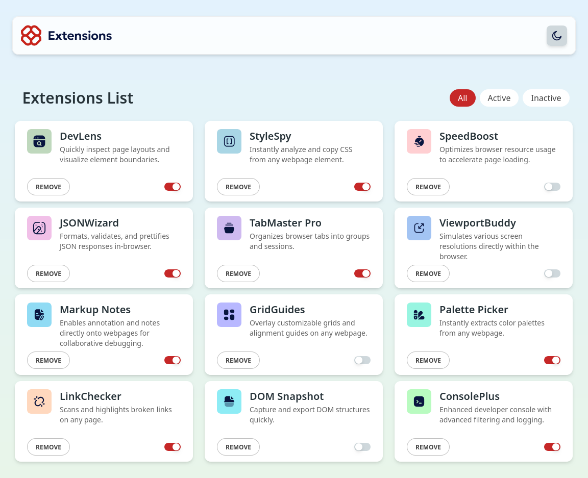

# Frontend Mentor - Browser extensions manager UI solution

This is a solution to the [Browser extensions manager UI challenge on Frontend Mentor](https://www.frontendmentor.io/challenges/browser-extension-manager-ui-yNZnOfsMAp). Frontend Mentor challenges help you improve your coding skills by building realistic projects.

## Table of contents

- [Overview](#overview)
  - [The challenge](#the-challenge)
  - [Screenshot](#screenshot)
  - [Links](#links)
- [My process](#my-process)
  - [Built with](#built-with)
  - [What I learned](#what-i-learned)
  - [Continued development](#continued-development)
  - [Useful resources](#useful-resources)
- [Author](#author)

## Overview

### The challenge

Users should be able to:

- Toggle extensions between active and inactive states
- Filter active and inactive extensions
- Remove extensions from the list
- Select their color theme
- View the optimal layout for the interface depending on their device's screen size
- See hover and focus states for all interactive elements on the page

### Screenshot



### Links

- [Solution URL](https://github.com/MucahitErdoganUnlu/browser-extensions-manager-ui-main)
- [Live Site URL](https://mucahiterdoganunlu.github.io/browser-extensions-manager-ui-main/)

## My process

### Built with

- Tailwindcss
- Flexbox
- CSS Grid
- [React](https://reactjs.org/) - JS library
- [Styled Components From Material Tailwind](https://www.material-tailwind.com/docs/react/) - For styles

### What I learned

This is the first project that I implemented state management in React. I used reducer.

As an example, my `reducer` function:

```js
function reducer(state, action) {
  switch (action.type) {
    case "SET_FILTER":
      return { ...state, filter: action.payload.filter };
    case "SET_DATA":
      return { ...state, data: action.payload.data };
    case "TOGGLE_ACTIVE":
      return {
        ...state,
        data: state.data.map((item) =>
          item.name === action.payload.name
            ? { ...item, isActive: !item.isActive }
            : item
        ),
      };
    case "REMOVE_EXTENSION":
      return {
        ...state,
        data: state.data.filter((item) => item.name !== action.payload.name),
      };
    case "TOGGLE_DARK_MODE":
      return { ...state, isDarkMode: !state.isDarkMode };

    default:
      throw new Error(`Unknown action type: ${action.type}`);
  }
}
```

### Continued development

Use this section to outline areas that you want to continue focusing on in future projects. These could be concepts you're still not completely comfortable with or techniques you found useful that you want to refine and perfect.

The areas I do not feel comfortable with:

- Box Model in CSS
- Grid & Flexbox
- Custom styling the components with CSS

I mostly Styled Components from `Material Tailwind`. Therefore, I did not used much custom css styling with tailwindcss. Even so, I was not comfortable with my custom stylings; although they are not intensive.

I did not give attention to `Semantic HTML Markups` but I want to do so in future projects.

### Useful resources

- [Reducer from WebDevSimplified](https://www.youtube.com/watch?v=kK_Wqx3RnHk) - I learnt `reducer` from this channel. Explanation is very simple and straightforward —as promised.
- [Traversy Media](https://www.youtube.com/@TraversyMedia) - I really liked the Brad's explanation of core concepts. I learnt HTML, CSS, Flex & Grid from this channel.

## Author

- Website - [Mucahit Erdogan Unlu](https://github.com/MucahitErdoganUnlu)
- Frontend Mentor - [@MucahitErdoganUnlu](https://www.frontendmentor.io/profile/MucahitErdoganUnlu)
